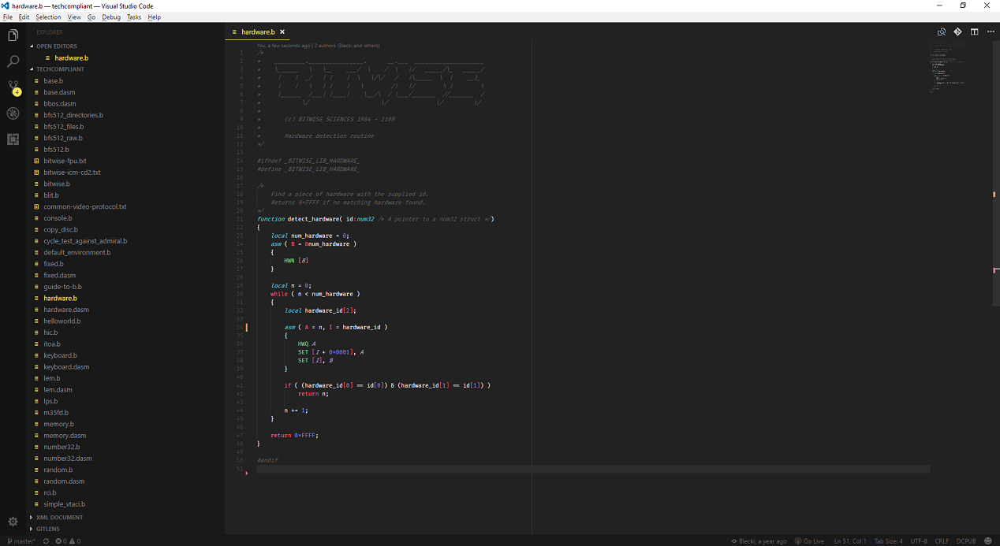
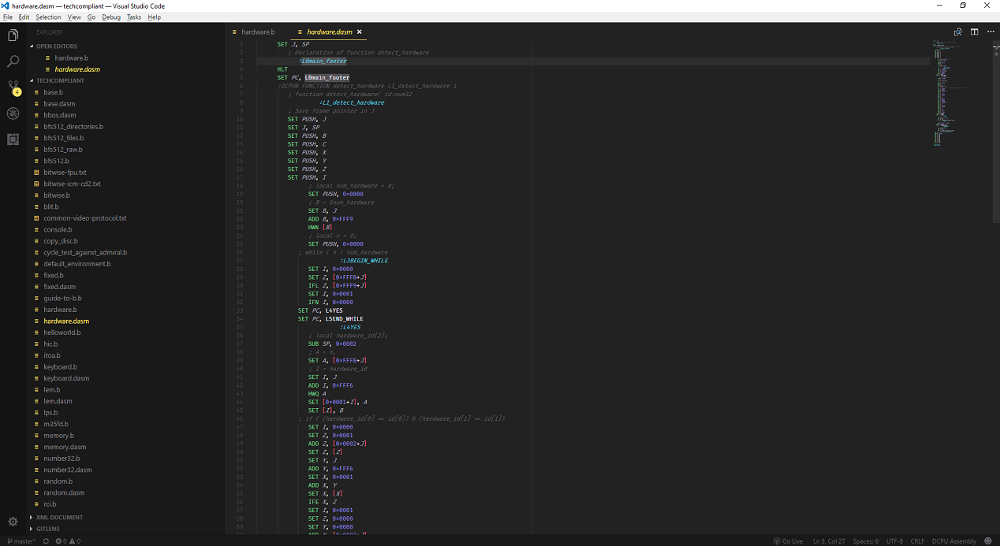

# DCPU Syntax Highlighting

This extension enables syntax highlighting to make reading [DCPU 1.7 Assembly](http://pastebin.com/raw/Q4JvQvnM) and [Blecki's DCPUB](https://github.com/Blecki/DCPUB) code easier on the eyes.

Notable projects using DCPU-16:

* [Techcompliant](https://github.com/techcompliant)

## Screenshots
 

## Want to contribute to this extension?

Visit the project's [Github](https://github.com/Chamberlain91/dcpu-syntax-highlighting).

**Enjoy!**
